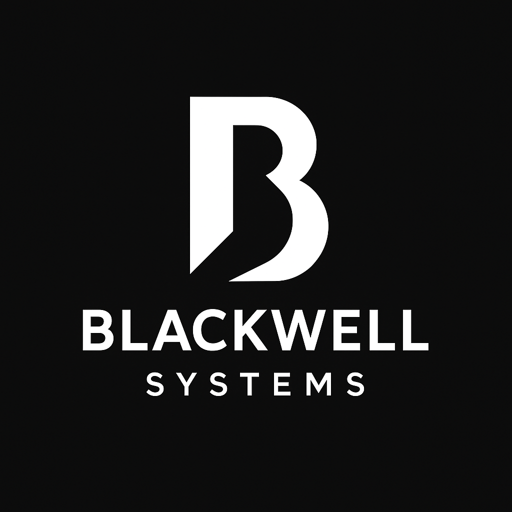

# pipeboard

> The programmable clipboard router for terminals

- One command across macOS, Linux, and WSL
- Sync between machines via SSH
- Store snippets in S3 with encryption
- Transform clipboard with user-defined pipelines

```bash
brew install blackwell-systems/tap/pipeboard
```

```bash
go install github.com/blackwell-systems/pipeboard@latest
```

```bash
curl -sSL https://pipeboard.dev/install.sh | sh
```

[GitHub](https://github.com/blackwell-systems/pipeboard)
[Get Started](#pipeboard)
