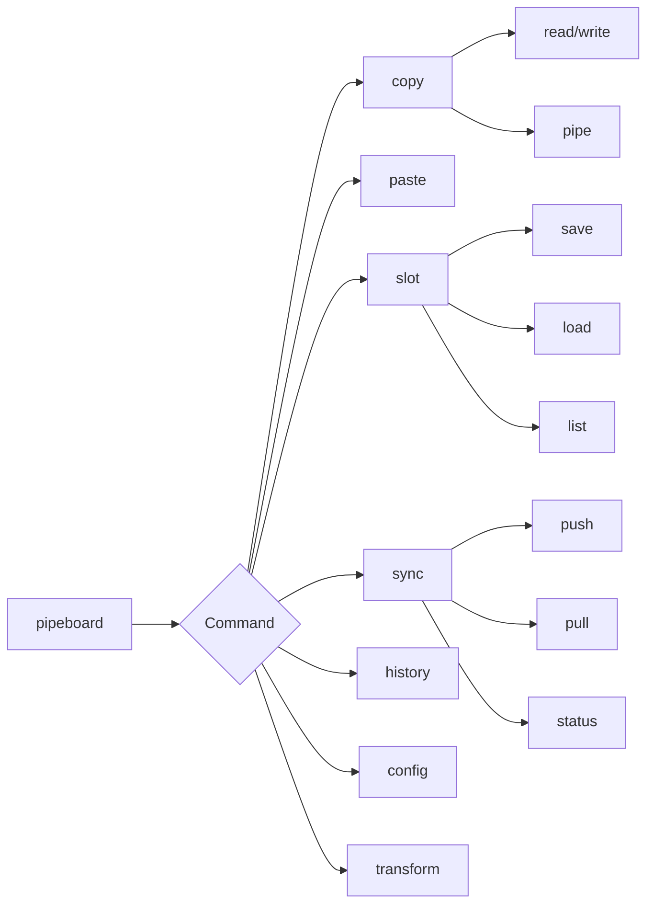
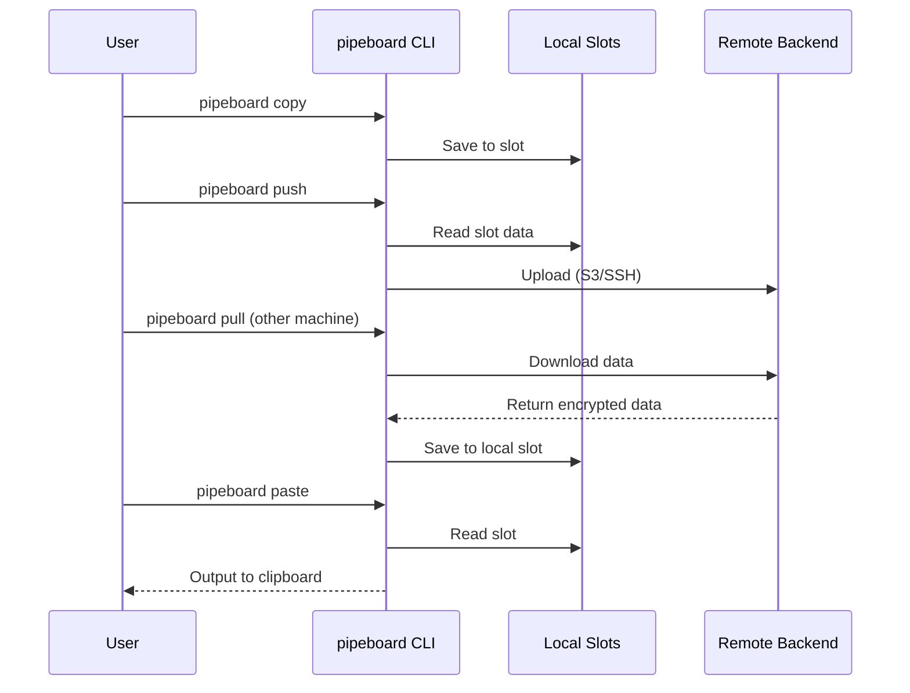
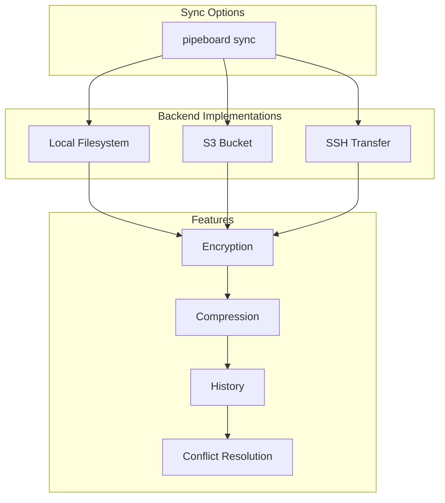
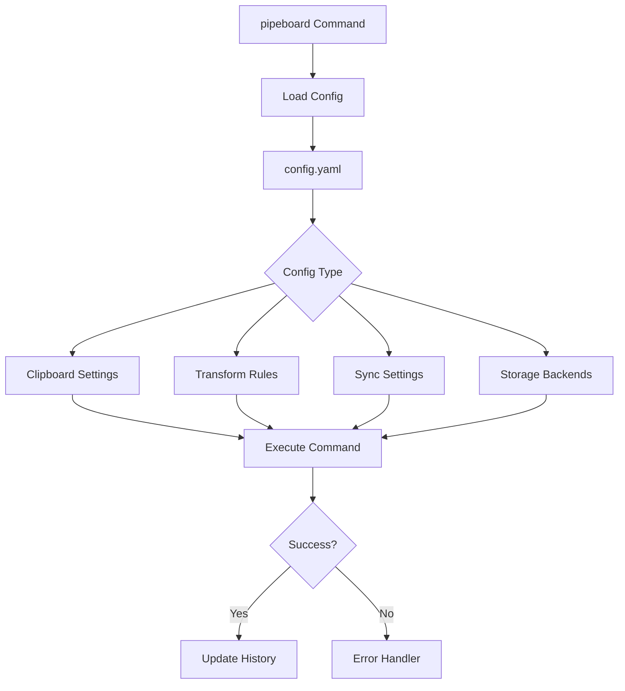

# Architecture

This page describes the high-level architecture and component interactions of the pipeboard system.

## System Overview


## Data Flow

The lifecycle of clipboard data through pipeboard:


## Component Architecture

### CLI Entry Point

The `pipeboard` command provides the main interface:



### Transform Pipeline

Transforms process clipboard data before storage:


## Sync Architecture

Pipeboard supports multiple sync backends:



### Sync Backends



## Platform Abstraction

Cross-platform clipboard access:


## Directory Structure

```
pipeboard/
├── main.go                 # Main entry point
├── cli.go                  # CLI interface and help text
├── clipboard.go            # Clipboard operations (copy/paste)
├── backend.go              # Platform clipboard detection
├── config.go               # Configuration management
├── crypto.go               # AES-256-GCM encryption
├── history.go              # Command and clipboard history
├── local.go                # Local filesystem backend
├── remote.go               # S3 backend with compression
├── peer.go                 # SSH peer sync
├── watch.go                # Real-time bidirectional sync
├── slots.go                # Remote slot management
├── fx.go                   # Transform pipelines
├── init.go                 # Interactive setup wizard
├── completion.go           # Shell completions
├── run.go                  # Subprocess execution
├── *_test.go               # Test files
└── docs/                   # Documentation
```

## Configuration Flow



## Security Architecture


## Transform System

Transforms are applied in a configurable chain:


## Error Handling


## Key Design Decisions

### 1. Slot-Based Storage
Instead of a single clipboard history, pipeboard uses named "slots" for organized clipboard management. This allows:
- Categorization (work vs personal)
- Long-term storage
- Easy retrieval by name

### 2. Transform Pipeline
Transforms are composable and can be chained. This enables:
- Reusable data processing
- Custom workflows
- Plugin-like extensibility

### 3. P2P Sync
Direct machine-to-machine transfer via SSH reduces cloud dependencies:
- No intermediary storage required
- Lower latency
- Privacy-focused

### 4. Encryption by Default
All stored data is encrypted before writing to disk or network:
- AES-256 encryption
- User-controlled keys
- Zero-knowledge architecture

### 5. Platform Abstraction
Unified clipboard API regardless of OS:
- Automatic platform detection
- Graceful fallbacks
- Consistent behavior across platforms

## Performance Characteristics

| Operation | Typical Latency |
|-----------|----------------|
| Local copy/paste | < 10ms |
| Transform application | 10-50ms |
| Local slot save | < 20ms |
| S3 sync | 100-500ms |
| SSH peer transfer | 50-200ms |
| History query | < 5ms |

## Extensibility Points

1. **Custom Transforms** - User-defined scripts in `~/.config/pipeboard/transforms/`
2. **Storage Backends** - Pluggable storage interface
3. **Platform Support** - New platform adapters via clipboard interface
4. **Sync Protocols** - Additional sync methods beyond S3/SSH

## Comparison: Pipeboard vs Traditional Clipboard

| Feature | Traditional Clipboard | Pipeboard |
|---------|---------------------|-----------|
| Cross-machine sync | No | Yes (S3, SSH, P2P) |
| Multiple slots | No (single clipboard) | Yes (named slots) |
| Transform pipeline | No | Yes (chainable) |
| History | Limited | Full history with search |
| Encryption | No | Yes (AES-256) |
| Platform support | OS-specific | Unified API |

## Data Model

### Slot Structure

```json
{
  "name": "slot-name",
  "content": "clipboard data",
  "transforms": ["trim", "lowercase"],
  "created": "2025-12-01T12:00:00Z",
  "modified": "2025-12-01T12:00:00Z",
  "metadata": {
    "size": 1024,
    "encoding": "utf-8",
    "encrypted": true
  }
}
```

### Configuration Schema

```yaml
clipboard:
  default_slot: "main"
  auto_save: true

transforms:
  - name: "cleanup"
    steps: ["trim", "normalize"]

sync:
  backend: "s3"
  auto_sync: false

storage:
  s3:
    bucket: "my-clipboard"
    region: "us-east-1"
  ssh:
    host: "peer-machine"
    path: "/home/user/.pipeboard/slots"
```

## See Also

- [Roadmap](roadmap.md) - Future enhancement ideas and feature proposals
