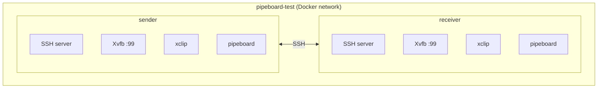

# Testing

This document describes how to run tests for pipeboard, including unit tests and integration tests.

## Unit Tests

pipeboard includes comprehensive Go unit tests covering all major functionality.

### Running Unit Tests

```bash
# Run all tests
go test ./...

# Run with verbose output
go test -v ./...

# Run with coverage
go test -cover ./...

# Generate coverage report
go test -coverprofile=coverage.out ./...
go tool cover -html=coverage.out
```

### Test Files

Unit tests are located alongside the code they test:

- `main_test.go` - CLI and main functionality
- `peer_test.go` - SSH peer synchronization
- `local_test.go` - Local slot storage
- `remote_test.go` - S3 remote storage
- `crypto_test.go` - Encryption/decryption
- `config_test.go` - Configuration loading
- `history_test.go` - Clipboard history
- `watch_test.go` - Watch mode
- `cli_test.go` - CLI parsing
- `benchmark_test.go` - Performance benchmarks

## Integration Tests

Integration tests verify end-to-end functionality using real environments.

### SSH Peer Integration Test

The SSH peer integration test validates pipeboard's ability to sync clipboard content between machines over SSH using Docker containers.

#### Prerequisites

- Docker installed and running
- Bash shell
- Internet connection (to pull Alpine images and Go dependencies)

#### Running the Test

```bash
# From the project root
./scripts/test-ssh-peer.sh
```

The script will automatically:
1. Create a Docker network
2. Spawn two Alpine containers (sender and receiver)
3. Install dependencies (SSH, Go, xclip, Xvfb)
4. Build pipeboard from source in both containers
5. Configure SSH keys for bidirectional communication
6. Set up virtual X server for clipboard access
7. Run three test scenarios
8. Clean up containers and network

#### Test Scenarios

**Test 1: Basic text transfer (sender → receiver)**
- Copies "Hello from sender" to sender's clipboard
- Sends clipboard to receiver via `pipeboard send`
- Verifies receiver can paste the exact text

**Test 2: Multiline content transfer**
- Copies multiline text to sender's clipboard
- Sends to receiver
- Verifies all lines are preserved correctly

**Test 3: Bidirectional transfer (receiver → sender)**
- Copies "Reply from receiver" to receiver's clipboard
- Sends clipboard to sender
- Verifies sender receives the text correctly

#### Test Architecture

The test creates an isolated environment with:



#### Implementation Details

**Clipboard Backend**

The test uses xclip with a custom wrapper to work around headless environment issues:

- xclip normally waits for another X client to request clipboard data before exiting
- In a headless Xvfb environment, nothing requests the clipboard
- Solution: wrapper script forks xclip to background, allowing pipeboard to continue

**SSH Configuration**

- Ed25519 key pairs generated for both containers
- Keys exchanged for bidirectional passwordless SSH
- Host keys added to known_hosts to avoid prompts
- `DISPLAY` environment variable passed through SSH

**pipeboard Configuration**

Each container has a config file at `~/.config/pipeboard/config.yaml`:

```yaml
version: 1
peers:
  receiver:  # or "sender" on the receiver
    ssh: root@pipeboard-receiver
    remote_cmd: env DISPLAY=:99 pipeboard
    default: true
```

#### Troubleshooting

**Test hangs at "Installing dependencies"**
- Docker may be pulling Alpine images or Go dependencies
- This is normal for first run; subsequent runs use cached images

**Test fails with "SSH connection failed"**
- Ensure Docker has network access
- Check Docker daemon is running: `docker ps`

**Test fails with "Build failed"**
- Ensure you have Go dependencies available
- Check internet connectivity for `go get`

**Clipboard operations timeout**
- The xclip wrapper should handle this
- If issues persist, check Xvfb is running: `docker exec pipeboard-sender ps aux | grep Xvfb`

#### Manual Testing

You can keep the test environment running for manual inspection:

```bash
# Run test and leave containers running
./scripts/test-ssh-peer.sh
# When prompted "Press Enter to cleanup", just wait

# In another terminal:
docker exec -it pipeboard-sender sh
# Now you're inside the sender container
export DISPLAY=:99
echo "test" | pipeboard copy
pipeboard send receiver

# Check receiver:
docker exec -it pipeboard-receiver sh
export DISPLAY=:99
pipeboard paste
```

#### Cleanup

The test automatically cleans up containers and networks when finished. If a test is interrupted:

```bash
# Manual cleanup
docker rm -f pipeboard-sender pipeboard-receiver
docker network rm pipeboard-test
```

## Continuous Integration

Tests run automatically on every push and pull request via GitHub Actions. See `.github/workflows/ci.yml` for CI configuration.

### Test Coverage

Current test coverage:
- Unit tests: 471 tests across all packages
- Integration tests: SSH peer sync (3 scenarios)
- Code coverage: See [codecov](https://codecov.io/gh/blackwell-systems/pipeboard)

## Writing Tests

### Unit Test Guidelines

- Test files should be named `<package>_test.go`
- Use table-driven tests for multiple scenarios
- Mock external dependencies (clipboard, SSH, S3)
- Include both success and error cases
- Test edge cases and boundary conditions

### Integration Test Guidelines

- Use Docker for isolated environments
- Clean up resources in trap handlers
- Provide clear error messages
- Test realistic end-to-end scenarios
- Document prerequisites and troubleshooting

## Performance Testing

Run benchmarks to measure performance:

```bash
go test -bench=. -benchmem ./...
```

Current benchmarks measure:
- Clipboard read/write operations
- Encryption/decryption speed
- Config parsing
- Network transfer overhead
